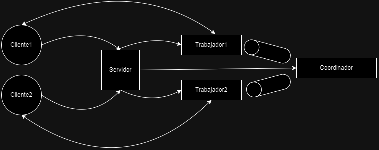

# Ejercicio 1

En el ejercicio 1 se hizo un archivo generar-compose.sh, al cual se le tiene que pasar por parámetro el nombre dle archivo que se va a escribir y la cantidad de clientes que se requiere

```bash
./generar-compose.sh docker-compose-dev.yml 5
```

En este archivo se llama a un script de go, en el cual se concatenan strings formateados para generar a los clientes.

Se cambia la variable de entorno PYTHONUNBUFFERED para que sea igual a la cantidad de clientes, de manera que los clientes que no estén siendo atendidos se queden en el buffer y sus mensajes no se pierdan.

A cada cliente se le pone el nombre **clientn** y se le cambia el id a **n**.

# Ejercicio 2

En el ejercicio 2, con el objetivo de que cambios en los archivos de configuración del cliente y del servidor no desembocaran en la recontrucción de la imágen, se montaron volúmenes para que la información de los archivos *config.ini* y *config.yaml* pueda ser accedida por el container directamente. 

También se agregaron estos archivos en el dockerignore, para que no fuera copiados dentro del container al momento de crear la imágen con COPY, sino que fueran montados en el docker-compose-dev.yaml.

# Ejercicio 3

En el ejercicio 3 se escribió un script que levanta un container basándose en la imagen **busybox**, la cual es una imágne liviana que incluye *netcat*. 

Se utiliza la flag --rm para que se elimine el container una vez terminada la operación. Como network le pasamos el nombre de la network levantada por docker-compose para nuestro cliente y servidor. Obtenemos el nombre haciendo `docker network ls`.

El comando `sh -c "echo '$mensaje' | nc server 12345" 2>/dev/null` tiene muchas partes:
- ``sh -c``: Es para ejecutar un comando en la shell.
- ``"echo '$mensaje' | nc server 12345"``: Manda el mensaje al ip `server` (nos podemos referir así a la ip del servidor por estar dentro de la red) y puerto 12345 (definido en el archivo de configuración).
- ``2>/dev/null``: Redirijimos stderr para que en caso de que la red no se encuentre activa, se imprima solamente "action: test_echo_server | result: fail" en vez del error que nos lanza docker, para que los test automatizados no se vean perjudicados.

Finalmente, si el último comando corrió bien ($? -eq 0) y la respuesta es igual al mensaje mandado, entonces imprimimos "action: test_echo_server | result: success". En caso contrario, imprimimos "action: test_echo_server | result: fail".

# Ejercicio 4

En el ejercicio 4 se escribieron mecanismos a través de los cuales el cliente y el servidor pueden manejar la señal SIGTERM para cerrar la conexión y poder terminar el programa de manera graceful. 

Investigando, vi que la flag `-t` incluida en el comando del makefile `docker compose -f docker-compose-dev.yaml stop -t 1`, al pasarle el número 1, va a dar 1 segundo a nuestras aplicaciones para que puedan reaccionar al SIGTERM, antes de cerrarlas más forzosamente.

En el servidor, se agregó un atributo para saber si ya recibimos la señal, de manera que si la recibimos dejaremos de aceptar nuevas conexiones. También, al recibir la señal tenemos configurado para que se ciuerre el socket en el que escuchamos por nuevas conexiones. En caso de que ya tuviérmamos una conexión abierta con un cliente al momento de recibir el SIGTERM (función handle client connection), entonces habrá un error y al tener un bloque finally, independientemente de si fue un éxito o un fracaso, se va a cerrar la conexión.

En el cliente, cambiamos en algo la estructura de nuestro programa. Ahora el loop del cliente se ejecuta en una `go routine`, mientras que en el main thread se espera por una señal. En caso de recibir la señal antes de terminar la ejecución del cliente (usamos un select para ir por un camino o el otro) entonces se cierra el socket del cliente, cortándose el loop.

# Ejercicio 5

Para este ejercicio tuvimos que cambiar el funcionamiento de tanto el cliente y el servidor, para que empiecen a hacer uso de la lógica de guardar apuestas.

Para ello se definió el siguiente protocolo para que los clientes puedan mandar sus apuestas. En orden de serialización.

- `Cantidad total de bytes`: Número de bytes totales del mensaje. Representado como un u16. Sirve para asegurarnos que al leer el mensaje no leamos partes del siguiente por error de formateo.
- `Numero de agencia`: Se toma como número de agencia al ID del cliente. Se representa con un u8, ya que para nuestros propósitos tendremos 5 clientes.
- `Longitud del nombre`: Longitud del nombre. Nos sirve para saber hasta donde leer. Representado por un u8, dado que los nombres con los que lidiaremos no superan los 255 caracteres.
- `Nombre`: El nombre del que hace la apuesta,
- `Longitud del apellido`: Longitud del apellido. Nos sirve para saber hasta donde leer. Representado por un u8, dado que los apellidos con los que lidiaremos no superan los 255 caracteres.
- `Apellido`: El apellido del que hace la apuesta,
- `Documento`: Un string de 8 caracteres. Es de tamaño fijo pues todos los DNI que tenemos en los archivos son de 8 caracteres (chequeado con el comando `cat agency-1.csv agency-2.csv agency-3.csv agency-4.csv agency-5.csv | awk -F',' '{print length($3)}' | uniq -`)
- `Fecha`: Fecha con un string de la forma YYYY-MM-DD
- `Número`: El número a apostar. Al ver que los valores en nuestro dataset van del 0 al 9999, decidí usar un u16 (`cat agency-1.csv agency-2.csv agency-3.csv agency-4.csv agency-5.csv | awk -F',' '{print $NF}' | sort -n | tail -1`)

En nuestro programa se declararon las variables de entorno especificadas en el enunciado en el docler-compose-dev.yaml. El cliente las toma y las envía al servidor, quien deserializa la apuesta y si lo logra hacer, responde con un mensaje de confirmación. Al estar mandando solo un mensaje, decidí hacerlo simple y que el servidor envía un u8 con el valor 1 en caso de **éxito** y un u8 con el valor 0 en caso de **error**.

Para este ejercicio no incluí cosas en el protocolo que tuvieran que ver con la agencia debido a que el enunciado no lo mencionó.

Tanto en el cliente en Go como en el servidor en Python, se crearon funciones read exact y write exact, las cuales se encargaban de leer y escribir a un socket, asegurándose de que no se diera un short read o un short write.

# Ejercicio 6

Para este ejercicio, se extendió el protocolo para que ahora las apuestas no se manden de a una, sino que podamos mandar muchas apuestas juntas.

Se descomprimieron los archivos *csv*, quedando estos en ``.data/dataset/``. Cada archivo corresponde a una agencia, de manera que vamos a tener un cliente por agencia, el cual leerá su archivo csv y mandará las apuestas en batches de máximo batch.maxAmount (establecido en config.yaml). 

Para que estos csv tan grandes no se estén copiando, decidí hacerles un bind mount, mappeando para cada cliente diferente el archivo con el csv a /app/agency.csv. De manera que todos los clientes van a sacar sus datos de agency.csv y su número de agencia de la variable de entorno AGENCIA. En el ejercicio pasado utilicé el id del cliente, pero ahora que tendremos muchas agencias, preferí separarlo en su propia varable También se actualizó el *generar-compose.sh* del ejercicio 1 para que agregue los volúmenes necesarios.

Cada cliente va a leer su archivo csv correspondiente y va a tomar tantas apuestas como las que definimos en el archivo de configuración. La manera de serializarlos es la misma que ne el ejercicio anterior, pero ahora pondremos al principio un `u8` que nos indicará la cantidad de apuestas que estamos mandando. El enunciado especifica que los batches no deberían superar los 8 KB, por lo que hice unos cálculos para verificar que con los datos que tenemos no superarmemos esa cantidad. 

Las únicas cantidades de datos variables en nuestro protocolo son los nombres y apellidos, pero usando los comandos `cat agency-1.csv agency-2.csv agency-3.csv agency-4.csv agency-5.csv | awk -F',' '{print length($1)}' | sort -n | tail -1` y `cat agency-1.csv agency-2.csv agency-3.csv agency-4.csv agency-5.csv | awk -F',' '{print length($2)}' | sort -n | tail -1` vemos que los nombres y apellidos con mayor tamaño son de 23 y 10 caracteres respectivamente.

Debido a esto, podemos estimar que cada apuesta, en el peor escenario será de 60 bytes. Para no pasarnos de la cantidad establecida, se mandarán batches de 130 apuestas como máximo.

El servidor por su parte va a leer primero la cantidad de apuestas que tiene que procesar y las va a deserializar a cada una como ya lo venía haciendo.

# Ejercicio 7

Para este ejercicio se extendió otra vez el protocolo para incluir al inicio un header `u8` que representa el tipo de mensaje, siendo 1 un mensaje que manda apuestas, mientras que 2 va a representar la pedida de los ganadores. Este mensaje, además del header, va a inlcuir otro u8 con el número de agencia, para saber por cual se está pidiendo. 

El servidor toma el número que definimos por configuración de listen backlog como la cantidad de clientes por los que va a esperar, entonces al momento que las 5 agencias mandaron un mensaje, este va a enviarle a cada uno los ganadores del sorteo.

Al recibir los mensajes pidiendo ganadores antes de terminar con los clientes, el servidor no va a responder todavía y va a guardarse la conección tcp para responder luego. Al llegarle un pedido de todas las agencias, va a recorrer las apuestas y generar listas de ganadores por agencia.

# Ejercicio 8

Para este ejercicio tenemos que poder procesar mensajes en paralelo. Para esto tendremos que hacer varios cambios en como funciona nuestra aplicación.

Para lograr esto vamos a hacer uso del módulo de multiprocessing en python. No usaré el de threading debido a que este se ve limitado por el ``GIL`` (Global Interpreter Lock), el cual ocasiona que un proceso solo pueda tener un thread ejecutando código a la vez, independientemente de cuantos threads tengamos en nuestro proceso. El módulo de multiprocessing tiene una API bastante similar y, en vez de usar threads en un mismo proceso, genera procesos nuevos, evitando las limitaciones del GIL.

Un primer cambio que planeo hacer es tener conexiones constantes. Dado que vamos a paralelizar las operaciones, puedo tener un proceso por cliente, de manera que no tiene sentido cerrar y volver a abrir la conexión como hacíamos en ejercicios anteriores para que se turnaras los clientes.

En el servidor vamos a tener un proceso por cada cliente. En estos procesos se van a transmitir las apuestas y se usará un lock para controlar el acceso a la función load bets, de manera que no hayan dos procesos intentando acceder a esta en simultaneo y así no tener problemas a la hora de escribir al archivo.

Al mismo tiempo, haremos uso de una barrera y una cola para sincronizar a nuestros procesos y que estos sepan cuando empezar con el sorteo. Tendremos un proceso al que llamé coordinador (probablemente no sea un nombre muy apropiado), el cual apenas empieza se pone a esperar en una barrera. Cuando a los procesos que manejan las conexiones con los clientes les llegue el mensaje pidiendo los resultados del sorteo, estos también esperarán en la barrera. Cuando CANT_PROCESOS + 1 estén esperando en la barrera esta se desbloquea. Acto seguido, el proceso coordinador se encarga de leer el archivo con load bets (es el único proceso que lo estará haciendo en ese momento) y calcula los ganadores. Luego los pasa a través de una cola a los diferentes procesos, los cuales se fijan en los resultados de su agencia y devuelven ese resultado al cliente.

De esta manera nos aseguramos de que 
1. Se paralelicen adecuadamente las operaciones por cliente.
2. Se modifique de a uno el archivo con las apuestas
3. Se sincronicen los procesos para que el sorteo se realice cuando finalizaron todos.
4. Se reciban los resultados de las apuestas y se comuniquen al cliente final.

Si tuviéramos 2 clientes, tendríamos los siguientes procesos

